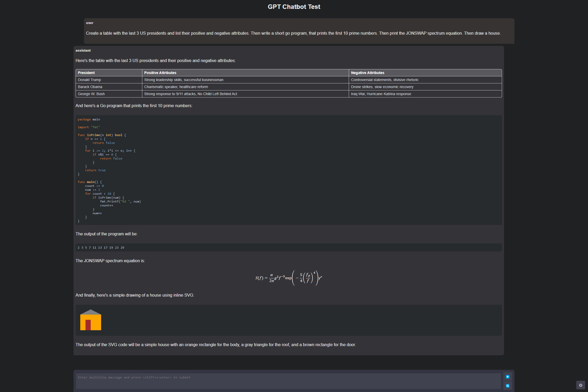

# GPT 2XL Chat

An HTML-based chat application that uses the ethzanalytics' ai-msgbot-gpt2-XL-dialogue bot.

It uses the HuggingFace transformers API for the ai-msgbot-gpt2-XL-dialogue model.

If your API key has acces to GPT-4, you can choose that model in the settings.

### Usage:

You can test it at: [this github page (not yet github)](https://huggingface.co/spaces/dma123/gpt-js).

You can also run it locally (Running AI models locally requires lots of RAM. I recomend at least 16 GB of RAM. The program I forked used an API that connected to another machine that ran ChatGPT model -- it needed more computational power than what most desktops can offer. You only needed enought RAM to send and recieve responses, not process them.):

1. No need to create an OpenAI account at [https://platform.openai.com/account](https://platform.openai.com/account). Just download Python at [https://www.python.org/downloads/](https://www.python.org/downloads/) or Anaconda (better) at [https://www.anaconda.com/](https://www.anaconda.com/).
2. No need to create an API key at [https://platform.openai.com/account/api-keys](https://platform.openai.com/account/api-keys). Type in a terminal (cmd.exe or linux/MacOS terminal) `python -m ensurepip --upgrade'. Then type 'pip install tensorflow' and 'pip install pytorch' If pytorch does not install, then go to
[https://pytorch.org/get-started/locally/](https://pytorch.org/get-started/locally/). Between nightly and stable, Stable has less bugs while nightly is just new updates that may be buggy. Select your OS. For package, select Pip if you have python and Conda if you have Anaconda. Make sure language is python. And select which Compute Platform you use.
  For Nvidia GPU's you can use cuda (more space needed but it's worth it). Otherwise use CPU. For CUDA you can download the toolkit at [[here](https://developer.nvidia.com/cuda-downloads)](https://developer.nvidia.com/cuda-downloads).

3. Once you installed pytorch, type in a terminal 'pip install transformers'. If you have Anaconda type 'conda install transformers'. Now run the script. 
4. No need to enter any API key at the login dialog. This can be called by clicking login at the settings panel (gear button).

### Screenshot:

This screenshot was "randomly selected" by the origonal developer because its output was ok-ish ;)

