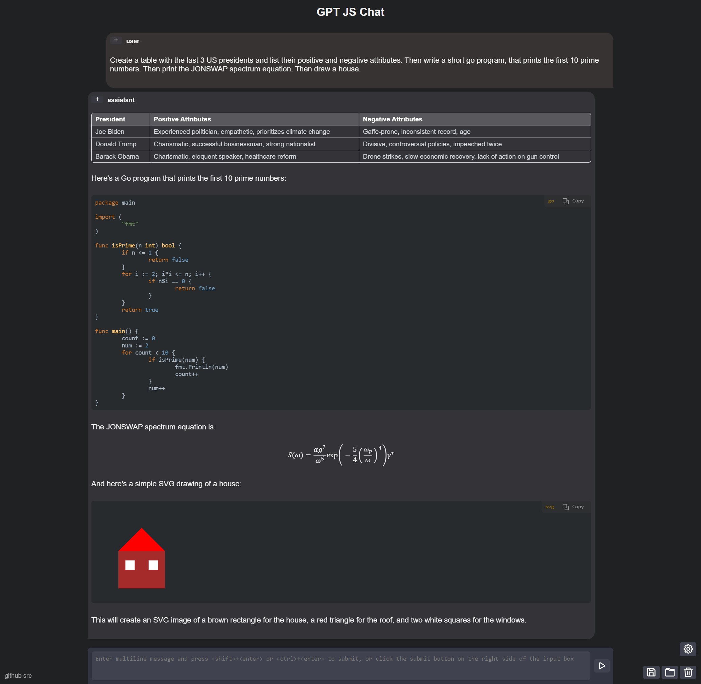

# GPT 2XL Chat

An HTML-based chat application that uses the ethzanalytics' ai-msgbot-gpt2-XL-dialogue bot.

It uses the HuggingFace transformers API for the ai-msgbot-gpt2-XL-dialogue model.

If your API key has acces to GPT-4, you can choose that model in the settings.

### Usage:

You can test it at: [https://huggingface.co/spaces/dma123/gpt-js](https://huggingface.cao/spaces/dma123/gpt-js).

You can also run it locally:

1. Create an OpenAI account at [https://platform.openai.com/account](https://platform.openai.com/account).
2. Create an API key at [https://platform.openai.com/account/api-keys](https://platform.openai.com/account/api-keys).
3. Enter the API key at the login dialog. This can be called by clicking login at the settings panel (gear button).

### Screenshot:

This screenshot was "randomly selected" because its output was ok-ish ;)

